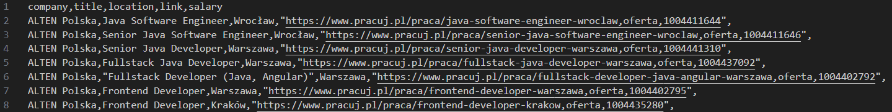
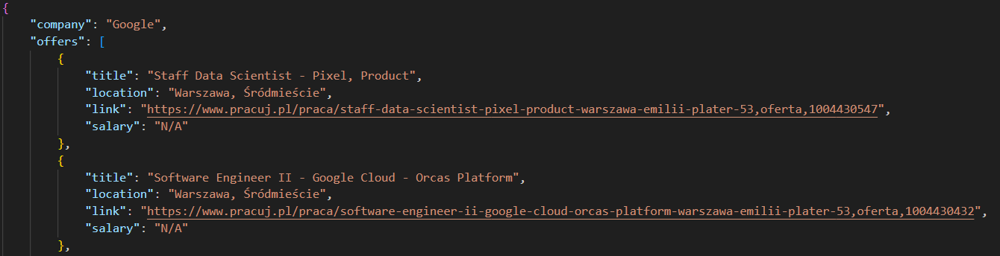
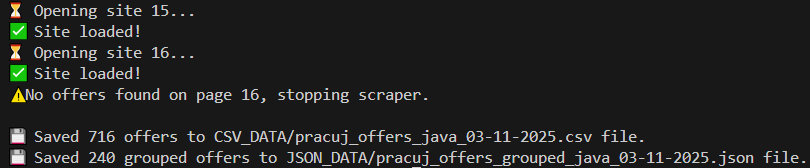

<h1 align="center">Pracuj.pl Job Offer Scraper</h1>

<p align="center">
  
  
  
  
  
</p>

<p align="center">
  
  
  
  
</p>

<p align="center"><i>Automated job offer scraper for Pracuj.pl built with Playwright and BeautifulSoup.</i></p>

## Table of Contents
- [About](#about)
- [Features](#features)
- [Requirements](#requirements)
- [Installation](#installation)
- [Usage](#usage)
- [Project Structure](#project-structure)
- [Example Output](#example-output)
- [Screenshots](#screenshots)
- [Tech Stack](#tech-stack)
- [Future Improvements](#future-improvements)
- [FAQ](#faq)
- [License](#license)
- [Author](#author)

<h2 id="about">About <span style="float:right">🧠</span></h2>

This project is a Python-based scraper that collects job listings from Pracuj.pl based on a keyword entered by the user (e.g. "Python", "JavaScript", etc.).
It uses **Playwright** to render dynamic content and **BeautifulSoup** to parse the extracted HTML.

The results are saved as:
- CSV (sorted by company name)
- JSON (grouped by company)

> ⚠️ This tool is intended for educational and research purposes only.

<h2 id="features">Features <span style="float:right">⚙️</span></h2>

- ✅ Scrapes job offers for any user-defined keyword  
- 🧩 Uses Playwright to handle dynamically rendered content  
- 📊 Exports results to CSV (sorted) and JSON (grouped by company)  
- 🔠 Automatically sorts CSV output alphabetically by company name  
- 🕒 Includes timestamps in filenames  

<h2 id="requirements">Requirements <span style="float:right">📌</span></h2>

- Python **3.11+** (tested on 3.12.7)
- Playwright installed with Chromium (see installation)
- Requires internet access — the scraper does not use cached data.

<h2 id="installation">Installation <span style="float:right">🛠️</span></h2>

```bash
# Clone the repository
git clone https://github.com/Seysane/pracuj_offer_scraper.git
cd pracuj_offer_scraper
```
```bash
# Create and activate a virtual environment
python -m venv env
source env/bin/activate   # macOS/Linux
env\Scripts\activate      # Windows
```
```bash
# Install dependencies
pip install -r requirements.txt
```
```bash
# Install Chromium for Playwright (required!)
playwright install chromium
# Or
playwright install  # installs Chromium, Firefox, WebKit
```

<h2 id="usage">Usage <span style="float:right">🚀</span></h2>

```bash
python main.py
```

You will be prompted to enter a keyword (e.g. `python`, `java`, `remote`, `junior`), and the scraper will automatically collect all job offers matching the keyword you entered.

The scraper will:
- Load all job offers from Pracuj.pl that match the keyword
- Extract and parse job data from internal JSON
- Save results into:

```
CSV_DATA/  → CSV file sorted alphabetically by company
JSON_DATA/ → JSON file grouped by company
```

<h2 id="project-structure">Project Structure <span style="float:right">📂</span></h2>

```
pracuj_offer_scraper/
├── CSV_DATA/                        # Contains all generated CSV files
├── JSON_DATA/                       # Contains all grouped JSON files
├── main.py                          # Main scraper script
├── requirements.txt                 # Python dependencies
└── README.md                        # Documentation
```

<h2 id="example-output">Example Output <span style="float:right">🧾</span></h2>

### CSV Example
```
company,title,location,link,salary
EPAM Systems,Azure Engineering Manager,Kraków,https://www.pracuj.pl/...,"No information provided"
Sii Sp. z o.o.,Python Automation Tester,Gdańsk,https://www.pracuj.pl/...,"-"
```

### JSON Example
```json
{
  "company": "Google",
  "offers": [
    {
      "title": "Software Engineer II - YouTube Ads",
      "location": "Warszawa, Śródmieście",
      "link": "https://www.pracuj.pl/praca/software-engineer-ii-youtube-ads-warszawa-emilii-plater-53,oferta,1004410373",
      "salary": "No information provided"
    },
    {
      "title": "Senior Software Engineer - Android ML Services",
      "location": "Kraków",
      "link": "https://www.pracuj.pl/praca/senior-software-engineer-android-ml-services-krakow,oferta,1004410339",
      "salary": "No information provided"
    }
  ]
}
```

<h2 id="screenshots">Screenshots <span style="float:right">📸</span></h2>

CSV Preview  


JSON Preview  


Terminal Run Example  


<h2 id="tech-stack">Tech Stack <span style="float:right">🧩</span></h2>

- Python 3.12.7 — Core language  
- [Playwright](https://playwright.dev/) — Browser automation  
- [BeautifulSoup](https://www.crummy.com/software/BeautifulSoup/) — HTML parsing  
- pandas — Dataset processing & CSV export  
- json — Grouped output format  
- datetime — Timestamp handling  

<h2 id="future-improvements">Future Improvements <span style="float:right">🔮</span></h2>

- Add CLI flags (`--keyword`, `--no-csv`, `--max-pages`)
- Add filtering (remote only, salary range, location)
- Add export to Excel or database

<h2 id="faq">FAQ <span style="float:right">❓</span></h2>

### Is scraping Pracuj.pl legal?
> No scraper can guarantee full compliance with site policies — you should use it **only for publicly available data** and respect the terms of use.

**Important:**  
- Check [`robots.txt`](https://www.pracuj.pl/robots.txt)  
- Avoid scraping disallowed paths  
- Respect Terms & Conditions  
- Do not overload the server  

### Why Playwright instead of requests?
> Pracuj.pl loads content dynamically via JavaScript — Playwright is required to render it.

### Does the scraper log into accounts or bypass protection?
> No. It only collects **publicly visible data**.

### Can I use this for commercial purposes?
> Yes, as long as you comply with Pracuj.pl’s ToS and the MIT License.

<h2 id="license">License <span style="float:right">⚖️</span></h2>
This project is licensed under the **MIT License**.  
See the [`LICENSE`](LICENSE) file for full details.

<h2 id="author">Author <span style="float:right">👨‍💻</span></h2>

Created by **Sebastian Siciński**  
📧 [itsbastian.kontakt@gmail.com](mailto:itsbastian.kontakt@gmail.com)  
🔗 [LinkedIn](https://www.linkedin.com/in/sebastian-sici%C5%84ski-b74096243/)  
🐙 [GitHub](https://github.com/Seysane)  

---

⭐ If you find this project useful, consider giving it a star!

[🔼 Back to top](#pracujpl-job-offer-scraper)